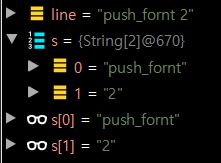

<!-- https://www.browserling.com/tools/number-lines  행번호 줄번호 붙이기 툴 text line number tool-->
<!-- http://mwultong.blogspot.com/2008/02/text-line-number-tool.html  행번호 줄번호 붙이기 툴 text line number tool-->

# 목차

- [문제 목록](#문제-목록)
- [알고리즘 분류](#알고리즘-분류)
- [문법](#문법)

---

## [문제 목록]

- 2019-10-30

  - baekjoon

  | 문제번호(클릭 시 해당 문제페이지로 이동)                                    | 문제 간단 설명                                                                 | 소스코드                                                                                               | 분류                                                             | 비고 |
  | --------------------------------------------------------------------------- | ------------------------------------------------------------------------------ | ------------------------------------------------------------------------------------------------------ | ---------------------------------------------------------------- | ---- |
  | [백준 온라인저지 9093번 - 단어뒤집기](https://www.acmicpc.net/problem/9093) | 문장이 주어졌을 때, 단어를 모두 뒤집어서 출력                                  | [problem_9093_java.md](https://github.com/DevLimK1/Algorithm/blob/master/stack/problem_9093_java.md)   | [stack](https://github.com/DevLimK1/Algorithm/tree/master/stack) |      |
  | [백준 온라인저지 10828번 - 스택](https://www.acmicpc.net/problem/10828)     | 정수를 저장하는 스택을 구현한 다음, 입력으로 주어지는 명령을 처리하는 프로그램 | [problem_10828_java.md](https://github.com/DevLimK1/Algorithm/blob/master/stack/problem_10828_java.md) | [stack](https://github.com/DevLimK1/Algorithm/tree/master/stack) |      |

* 2019-11-02

  | 문제번호(클릭 시 해당 문제페이지로 이동)                             | 문제 간단 설명                        | 소스코드                                                                                                                                            | 분류                                                           | 비고 |
  | -------------------------------------------------------------------- | ------------------------------------- | --------------------------------------------------------------------------------------------------------------------------------------------------- | -------------------------------------------------------------- | ---- |
  | AVL-tree(균형트리) 문제 (except removeTree) [학교 알고리즘 실습문제] | AVL-tree(균형트리)(except removeTree) | [problem_AVLtree_C(except removeTree).md](<https://github.com/DevLimK1/Algorithm/blob/master/tree/problem_AVLtree_C(except%20removeTree)191102.md>) | [tree](https://github.com/DevLimK1/Algorithm/tree/master/tree) |      |

- 2019-11-05

  | 문제번호(클릭 시 해당 문제페이지로 이동)         | 문제 간단 설명          | 소스코드                                                                                                          | 분류                                                           | 비고 |
  | ------------------------------------------------ | ----------------------- | ----------------------------------------------------------------------------------------------------------------- | -------------------------------------------------------------- | ---- |
  | AVL-tree(균형트리) 문제 [학교 알고리즘 실습문제] | AVL-tree(균형트리) 문제 | [problem_AVLtree_C_191105.md](https://github.com/DevLimK1/Algorithm/blob/master/tree/problem_AVLtree_C_191105.md) | [tree](https://github.com/DevLimK1/Algorithm/tree/master/tree) |      |

* 2019-11-06

  - baekjoon

  | 문제번호(클릭 시 해당 문제페이지로 이동)                              | 문제 간단 설명                                                                                                   | 소스코드                                                                                                           | 분류                                                             | 비고 |
  | --------------------------------------------------------------------- | ---------------------------------------------------------------------------------------------------------------- | ------------------------------------------------------------------------------------------------------------------ | ---------------------------------------------------------------- | ---- |
  | [백준 온라인저지 9012번 - 괄호](https://www.acmicpc.net/problem/9012) | 주어진 괄호 문자열이 VPS(한 쌍의 괄호 기호로 된 “( )” 문자열) 인지 아닌지를 판단해서 그 결과를 YES 와 NO 로 출력 | [problem_9012_java_191106.md](https://github.com/DevLimK1/Algorithm/blob/master/stack/problem_9012_java_191106.md) | [stack](https://github.com/DevLimK1/Algorithm/tree/master/stack) |      |

* 2019-11-07

  - baekjoon

  | 문제번호(클릭 시 해당 문제페이지로 이동)                                   | 문제 간단 설명                                                                            | 소스코드                                                                                                           | 분류                                                             | 비고 |
  | -------------------------------------------------------------------------- | ----------------------------------------------------------------------------------------- | ------------------------------------------------------------------------------------------------------------------ | ---------------------------------------------------------------- | ---- |
  | [백준 온라인저지 1874번 - 스택 수열](https://www.acmicpc.net/problem/1874) | 1부터 n까지의 수를 스택에 넣었다가 뽑아 늘어놓음으로써, 하나의 수열을 만들어 낼 수 있는지 | [problem_1874_java_191107.md](https://github.com/DevLimK1/Algorithm/blob/master/stack/problem_1874_java_191107.md) | [stack](https://github.com/DevLimK1/Algorithm/tree/master/stack) |      |

- 2019-11-21

  | 문제번호(클릭 시 해당 문제페이지로 이동)                                   | 문제 간단 설명          | 소스코드                                                                                                                       | 분류                                                             | 비고 |
  | -------------------------------------------------------------------------- | ----------------------- | ------------------------------------------------------------------------------------------------------------------------------ | ---------------------------------------------------------------- | ---- |
  | Graph AdjacencyList(무방향그래프 인접리스트) 문제 [학교 알고리즘 실습문제] | 무방향그래프 인접리스트 | [problem_graphAdjacencyList_C.md](https://github.com/DevLimK1/Algorithm/blob/master/graph/problem_graphAdjacencyList_C.md)     | [graph](https://github.com/DevLimK1/Algorithm/tree/master/graph) |      |
  | Graph AdjacencyMatrix(무방향그래프 인접행렬) 문제 [학교 알고리즘 실습문제] | 무방향그래프 인접행렬   | [problem_graphAdjacencyMatrix_C.md](https://github.com/DevLimK1/Algorithm/blob/master/graph/problem_graphAdjacencyMatrix_C.md) | [graph](https://github.com/DevLimK1/Algorithm/tree/master/graph) |      |

* 2019-11-22

  | 문제번호(클릭 시 해당 문제페이지로 이동)                                                      | 문제 간단 설명                         | 소스코드                                                                                                                           | 분류                                                             | 비고 |
  | --------------------------------------------------------------------------------------------- | -------------------------------------- | ---------------------------------------------------------------------------------------------------------------------------------- | ---------------------------------------------------------------- | ---- |
  | Graph AdjacencyList DFS(무방향그래프 인접리스트 깊이 우선 탐색) 문제 [학교 알고리즘 실습문제] | 무방향그래프 인접리스트 깊이 우선 탐색 | [problem_graphAdjacencyListDFS_C.md](https://github.com/DevLimK1/Algorithm/blob/master/graph/problem_graphAdjacencyListDFS_C.md)   | [graph](https://github.com/DevLimK1/Algorithm/tree/master/graph) |      |
  | Graph AdjacencyMatrix BFS(무방향그래프 인접행렬 너비 우선 탐색) 문제 [학교 알고리즘 실습문제] | 무방향그래프 인접행렬 너비 우선 탐색   | [problem_graphAdjacencyMatrixBFS_C.md](https://github.com/DevLimK1/Algorithm/blob/master/graph/problem_graphAdjacencyListBFS_C.md) | [graph](https://github.com/DevLimK1/Algorithm/tree/master/graph) |      |

- 2020-03-03

  - baekjoon

  | 문제번호(클릭 시 해당 문제페이지로 이동)                     | 문제 간단 설명                            | 소스코드                                                                                                                 | 분류 | Posting                                                                                       |
  | ------------------------------------------------------------ | ----------------------------------------- | ------------------------------------------------------------------------------------------------------------------------ | ---- | --------------------------------------------------------------------------------------------- |
  | [2557 - Hello World! ](https://www.acmicpc.net/problem/2557) | Hello World!를 출력                       | 즉석에서 풀이                                                                                                            | I/O  |                                                                                               |
  | [1000 - A+B](https://www.acmicpc.net/problem/1000)           | 두 정수 A와 B를 입력받은 다음, A+B를 출력 | 즉석에서 풀이                                                                                                            | I/O  |                                                                                               |
  | [2558 - A+B - 2](https://www.acmicpc.net/problem/2558)       | 두 정수 A와 B를 입력받은 다음, A+B를 출력 | [Main_2558.java](https://github.com/DevLimK1/Algorithm/blob/master/baekjoon/SourceCode/src/InputOutput/Main_2558.java)   | I/O  |                                                                                               |
  | [10950 - A+B - 3](https://www.acmicpc.net/problem/10950)     | 두 정수 A와 B를 입력받은 다음, A+B를 출력 | 즉석에서 풀이                                                                                                            | I/O  |                                                                                               |
  | [10951 - A+B - 4](https://www.acmicpc.net/problem/10951)     | 두 정수 A와 B를 입력받은 다음, A+B를 출력 | [Main_10951.java](https://github.com/DevLimK1/Algorithm/blob/master/baekjoon/SourceCode/src/InputOutput/Main_10951.java) | I/O  | [boj.kr_10951.md](https://github.com/DevLimK1/Algorithm/blob/master/baekjoon/boj.kr_10951.md) |

- 2020-03-04

  - baekjoon

  | 문제번호(클릭 시 해당 문제페이지로 이동)                         | 문제 간단 설명                                                       | 소스코드                                                                                                                 | 분류 | 비고                                                                                          |
  | ---------------------------------------------------------------- | -------------------------------------------------------------------- | ------------------------------------------------------------------------------------------------------------------------ | ---- | --------------------------------------------------------------------------------------------- |
  | [10952 - A+B - 5](https://www.acmicpc.net/problem/10952)         | 두 정수 A와 B를 입력받은 다음, A+B를 출력                            | [Main_10952.java](https://github.com/DevLimK1/Algorithm/blob/master/baekjoon/SourceCode/src/InputOutput/Main_10952.java) | I/O  |                                                                                               |
  | [10953 - A+B - 6](https://www.acmicpc.net/problem/10953)         | 두 정수 A와 B를 입력받은 다음, A+B를 출력                            | [Main_10953.java](https://github.com/DevLimK1/Algorithm/blob/master/baekjoon/SourceCode/src/InputOutput/Main_10953.java) | I/O  |                                                                                               |
  | [11021- A+B - 7](https://www.acmicpc.net/problem/11021)          | 두 정수 A와 B를 입력받은 다음, A+B를 출력하는 프로그램을 작성하시오. | [Main_11021.java](https://github.com/DevLimK1/Algorithm/blob/master/baekjoon/SourceCode/src/InputOutput/Main_11021.java) | I/O  |                                                                                               |
  | [11022 - A+B -8](https://www.acmicpc.net/problem/11022)          | 두 정수 A와 B를 입력받은 다음, A+B를 출력하는 프로그램을 작성하시오. | [Main_11022.java](https://github.com/DevLimK1/Algorithm/blob/master/baekjoon/SourceCode/src/InputOutput/Main_11022.java) | I/O  |                                                                                               |
  | [11718 - 그대로 출력하기](https://www.acmicpc.net/problem/11718) | 입력 받은 대로 출력하는 프로그램을 작성하시오.                       | [Main_11718.java](https://github.com/DevLimK1/Algorithm/blob/master/baekjoon/SourceCode/src/InputOutput/Main_11718.java) | I/O  | [boj.kr_10953.md](https://github.com/DevLimK1/Algorithm/blob/master/baekjoon/boj.kr_10953.md) |

- 2020-03-06

  - baekjoon

  | 문제번호(클릭 시 해당 문제페이지로 이동)                               | 문제 간단 설명                                                  | 소스코드                                                                                                                 | 분류 | 비고 |
  | ---------------------------------------------------------------------- | --------------------------------------------------------------- | ------------------------------------------------------------------------------------------------------------------------ | ---- | ---- |
  | [11719 - 그대로 출력하기 2](https://www.acmicpc.net/problem/11719)     | 입력 받은 대로 출력하는 프로그램을 출력                         | [Main_11719.java](https://github.com/DevLimK1/Algorithm/blob/master/baekjoon/SourceCode/src/InputOutput/Main_11719.java) | I/O  |      |
  | [11720 - 숫자의 합](https://www.acmicpc.net/problem/11720)             | N개의 숫자가 공백 없이 쓰여있다. 이 숫자를 모두 합해서 출력     | [Main_11720.java](https://github.com/DevLimK1/Algorithm/blob/master/baekjoon/SourceCode/src/InputOutput/Main_11720.java) | I/O  |      |
  | [11721 - 열 개씩 끊어 출력하기](https://www.acmicpc.net/problem/11721) | 알파벳 소문자와 대문자로만 이루어진 길이가 N인 단어가 주어진다. | [Main_11721.java](https://github.com/DevLimK1/Algorithm/blob/master/baekjoon/SourceCode/src/InputOutput/Main_11721.java) | I/O  |      |

- 2020-03-07

  - programmers

  | 문제번호(클릭 시 해당 문제페이지로 이동)                            | 문제 간단 설명                                                                        | 소스코드                                                                                                                | 분류       | 비고                                                                                                     |
  | ------------------------------------------------------------------- | ------------------------------------------------------------------------------------- | ----------------------------------------------------------------------------------------------------------------------- | ---------- | -------------------------------------------------------------------------------------------------------- |
  | [2016년](https://programmers.co.kr/learn/courses/30/lessons/12901)  | 두 수 a ,b를 입력받아 2016년 a월 b일이 무슨 요일인지 리턴                             | [v1_Ex02_2016년.java](https://github.com/DevLimK1/Algorithm/blob/master/programmers/src/level1/lv1_Ex02_2016년.java)    | 배열       | [lv1_Ex02_2016년.md](https://github.com/DevLimK1/Algorithm/blob/master/programmers/lv1_Ex02_2016년.md)   |
  | [k번째수](https://programmers.co.kr/learn/courses/30/lessons/42748) | 배열 array의 i번째 숫자부터 j번째 숫자까지 자르고 정렬했을 때, k번째에 있는 수 구하기 | [lv1_Ex03_k번째수.java](https://github.com/DevLimK1/Algorithm/blob/master/programmers/src/level1/lv1_Ex03_k번째수.java) | sort(정렬) | [lv1_Ex03_k번째수.md](https://github.com/DevLimK1/Algorithm/blob/master/programmers/lv1_Ex03_k번째수.md) |

  - [Algorithm/TIL]

  | 문제번호(클릭 시 해당 문제페이지로 이동) | 문제 간단 설명 | 소스코드                                                                                      | 분류                                                                         | 비고 |
  | ---------------------------------------- | -------------- | --------------------------------------------------------------------------------------------- | ---------------------------------------------------------------------------- | ---- |
  | 선택정렬                                 | 선택정렬 구현  | [선택정렬.java](https://github.com/DevLimK1/Algorithm/blob/master/TIL/src/sort/선택정렬.java) | [sort(정렬)](https://github.com/DevLimK1/Algorithm/tree/master/TIL/src/sort) |      |
  
- 2020-03-09

  - baekjoon

  | 문제번호(클릭 시 해당 문제페이지로 이동)                    | 문제 간단 설명                                         | 소스코드                                                     | 분류 | 비고 |
  | ----------------------------------------------------------- | ------------------------------------------------------ | ------------------------------------------------------------ | ---- | ---- |
  | [1924 - 2007년](https://www.acmicpc.net/problem/1924)       | 2007년 x월 y일은 무슨 요일일까? 이를 알아내는 프로그램 | [Main_1924.java](https://github.com/DevLimK1/Algorithm/blob/master/baekjoon/SourceCode/src/InputOutput/Main_1924.java) | I/O  |      |
  | [2438 - 별 찍기-1](https://www.acmicpc.net/problem/2438)    | 별 찍기                                                | [Main_2438.java](https://github.com/DevLimK1/Algorithm/blob/master/baekjoon/SourceCode/src/InputOutput/Main_2438.java) | I/O  |      |
  | [2439 - 별 찍기-2](https://www.acmicpc.net/problem/2439)    | 별 찍기                                                | [Main_2439.java](https://github.com/DevLimK1/Algorithm/blob/master/baekjoon/SourceCode/src/InputOutput/Main_2439.java) | I/O  |      |
  | [2440 - 별 찍기-3](https://www.acmicpc.net/problem/2440)    | 별 찍기                                                | [Main_2440.java](https://github.com/DevLimK1/Algorithm/blob/master/baekjoon/SourceCode/src/InputOutput/Main_2440.java) | I/O  |      |
  | [10818 - 최소, 최대](https://www.acmicpc.net/problem/10818) | 최솟값, 최댓값 구하기                                  | [Main_10818.java](https://github.com/DevLimK1/Algorithm/blob/master/baekjoon/SourceCode/src/InputOutput/Main_10818.java) | I/O  |      |
  | [8393 - 합](https://www.acmicpc.net/problem/8393)           | 합구하기                                               | 즉석에서 풀이                                                | I/O  |      |

- 2020-03-16

  - baekjoon
	
	| 문제번호(클릭 시 해당 문제페이지로 이동)                 | 문제 간단 설명 | 소스코드                                                     | 분류 | 비고 |
	| -------------------------------------------------------- | -------------- | ------------------------------------------------------------ | ---- | ---- |
	| [2441 - 별찍기 -4](https://www.acmicpc.net/problem/2441) | 별 찍기        | [Main_2441.java](https://github.com/DevLimK1/Algorithm/blob/master/baekjoon/SourceCode/src/InputOutput/Main_2441.java) | I/O  |      |
	| [2442 - 별찍기 -5](https://www.acmicpc.net/problem/2442) | 별 찍기        | [Main_2442.java](https://github.com/DevLimK1/Algorithm/blob/master/baekjoon/SourceCode/src/InputOutput/Main_2442.java) | I/O  |      |
	
- 2020-03-19

  - baekjoon

  | 문제번호(클릭 시 해당 문제페이지로 이동)                 | 문제 간단 설명 | 소스코드                                                     | 분류 | 비고 |
  | -------------------------------------------------------- | -------------- | ------------------------------------------------------------ | ---- | ---- |
  | [2445 - 별찍기 -8](https://www.acmicpc.net/problem/2445) | 별 찍기        | [Main_2445.java](https://github.com/DevLimK1/Algorithm/blob/master/baekjoon/SourceCode/src/InputOutput/Main_2445.java) | I/O  |      |

  


## [알고리즘 분류]

- 배열(Array) : [programmers/2016년](<[https://github.com/DevLimK1/Algorithm/blob/master/programmers/lv1_Ex02_2016%EB%85%84.md](https://github.com/DevLimK1/Algorithm/blob/master/programmers/lv1_Ex02_2016년.md)>)
- 스택(Stack): [Algorithm/stack](https://github.com/DevLimK1/Algorithm/tree/master/stack)
- 트리(Tree): [Algorithm/tree](https://github.com/DevLimK1/Algorithm/tree/master/tree)
- 그래프(Graph): [Algorithm/graph](https://github.com/DevLimK1/Algorithm/tree/master/graph)
- 입출력(InputOutput): [baekjoon/InputOutput(I/O)](https://github.com/DevLimK1/Algorithm/tree/master/baekjoon/SourceCode/src/InputOutput)
- 정렬(Sort): [TIL/Sort](https://github.com/DevLimK1/Algorithm/tree/master/TIL/src/sort) , [programmers/k번째수](<[https://github.com/DevLimK1/Algorithm/blob/master/programmers/lv1_Ex03_k%EB%B2%88%EC%A7%B8%EC%88%98.md](https://github.com/DevLimK1/Algorithm/blob/master/programmers/lv1_Ex03_k번째수.md)>)

---

## [문법]

- [JAVA](#JAVA)
- [C](#C)

### `<JAVA>`

> #### [nextLine()을 활용한 개행문자 제거]
>
> ```java
>    Scanner sc = new Scanner(System.in);
>    int cmdSize = sc.nextInt(); // 첫 줄 입력 사이즈
>    sc.nextLine(); //nextInt()에서 발생하는 개행문자 제거
> ```
>
> 활용 예제:[Deque_Baekjoon-10866](https://github.com/DevLimK1/TIL/blob/master/Algorithm/Deque/Deque_Baekjoon-10866.md)

---

> #### [Split함수를 활용하여 단어를 String배열에 한글자씩 저장]
>
> ```java
>  String line = sc.nextLine(); //문자열 입력
>  String[] s = line.split(" "); //스페이스로 문자열 구분해서 배열에 입력
>  String cmd = s[0]; // cmd<-문자열 입력 부분
> ```
>
> >  <br>
> >
> > -> "push_fornt 2" 라고 입력했을 때 스페이스로 문자열을 구분해서 String 배열에 입력된다.<br>
>
> 활용 문제:[Deque_Baekjoon-10866](https://github.com/DevLimK1/TIL/blob/master/Algorithm/Deque/Deque_Baekjoon-10866.md)

---

> #### [Split함수를 활용하여 단어를 String배열에 한글자씩 저장2]
>
> ```java
> String word = "POWER"; //스트링 문자 POWER
> String[] array_word; // 스트링을 담을 배열
>
> array_word = word.split(""); //배열에 한글자씩 저장하기
>
> for(int i=0;i<array_word.length;i++) { //출력
>    System.out.println(array_word[i]);
> }
> ```
>
> 활용 문제: [problem_9012_java](https://github.com/DevLimK1/Algorithm/blob/master/stack/problem_9012_java_191106.md) , [problem_9093_java](https://github.com/DevLimK1/Algorithm/blob/master/stack/problem_9093_java.md)

---

> #### [charAt 함수를 활용하여 단어를 char배열에 한글자씩 저장]
>
> ```java
> String word = "POWER"; //스트링 문자 POWER
> char[] array_word = new char[word.length()]; // 스트링을 담을 배열
>
> for(int i=0;i<array_word.length;i++){
> 	array_word[i]=(word.charAt(i));//스트링을 한글자씩 끊어 배열에 저장
> 	System.out.println(array_word[i]); //출력
> }
> ```
>
> 활용 예제:[problem_1874_java_191107.md](https://github.com/DevLimK1/Algorithm/blob/master/stack/problem_1874_java_191107.md)

<!-- https://coding-factory.tistory.com/73 -->

---

> #### [BufferedReader]
>
> - Scanner를 통해 입력을 받을경우 Space Enter를 모두 경계로 인식해서 데이터를 입력받음
> - BufferedReader는 Enter만 경계로 인식하고 받은 데이터가 String으로 고정됨
> - 많은 양의 데이터를 입력받은 경우 BufferedReader를 통해 입력받는 것이 작업속도가 빠름
>
> > ```java
> > BufferedReader bf = new BufferedReader(new InputStreamReader(System.in)); //선언
> > String s = bf.readLine(); //String
> > int i = Integer.parseInt(bf.readLine()); //Int
> > ```
> >
> > -> readLine()시 리턴값을 String으로 고정되기에 String이 아닌 다른타입으로 입력을 받을려면 형변환을 해주어야한다.<br>
> > -> 예외 처리를 꼭 해줘야한다. readLine()을 할때마다 try & catch를 활용하여 예외처리를 해주어도 되지만 대개 throws IOException을 통하여 작업 **_(public static void main(String[] args) throws IOException)_**
>
> 활용 예제: [problem_9012_java](https://github.com/DevLimK1/Algorithm/blob/master/stack/problem_9012_java_191106.md) , [problem_9093_java](https://github.com/DevLimK1/Algorithm/blob/master/stack/problem_9093_java.md)
>
> #### [BufferedWriter]
>
> > ```java
> > BufferedWriter bw = new BufferedWriter(new OutputStreamWriter(System.out));//선언
> > String s = "abcdefg";//출력할 문자열
> > bw.write(s+"\n");//출력
> > bw.flush();//남아있는 데이터를 모두 출력시킴
> > bw.close();//스트림을 닫음
> > ```
> >
> > -> BufferedWriter 의 경우 버퍼를 잡아 놓았기 때문에 반드시 flush()/ close() 를 반드시 호출해 주어 뒤처리를 해주어야한다.<br>
> > -> bw.write에는 System.out.println();과 같이 자동개행기능이 없기때문에 개행을 해주어야할 경우에는 \n를 통해 따로 처리해주어야한다.
>
> 활용 예제: [problem_9093_java.md](https://github.com/DevLimK1/Algorithm/blob/master/stack/problem_9093_java.md)

<!-- https://coding-factory.tistory.com/251 -->

---

> #### [String에 문자를 덧붙일 때 String + String 말고 StringBuilder를 사용하자]
>
> - String에 +=을 하는 건 기존 String의 내용에 뒤의 String의 내용을 이어붙인 새로운 문자열을 만들어서 담고, 원래의 문자열은 더 참조하는 레퍼런스가 없으면 GC에 들어감
> - 버려진 문자열이 정확히 언제 메모리에서 완전히 해제되는지는 모르겠지만, 그 전까지는 계속 메모리상에 누적되어 큰 용량을 차지함
> - 문자열을 길게 계속 이어붙이려면 StringBuilder를 사용하는게 성능면에서 좋음
>
> ```java
> StringBuilder sb=new StringBuilder();
> sb.append("A");
> sb.append("B");
> System.out.println(sb);
>
> 결과:
> AB
> ```
>
> 활용 예제:[problem_1874_java_191107.md](https://github.com/DevLimK1/Algorithm/blob/master/stack/problem_1874_java_191107.md)

<!-- https://hardlearner.tistory.com/288 -->
<!-- https://www.acmicpc.net/board/view/37647 -->

---

> #### [EOF 처리 -> Scanner , BufferedReader 클래스]
>
> - 컴퓨팅에서, **파일 끝(End of File, EOF)** 는 데이터 소스로부터 더 이상 읽을 수 있는 데이터가 없음을 나타낸다.
> - 주로 _입력 부분의 기준이 없는 문제_ 에서 사용
>
> ```java
> <Scanner 클래스>
>
> Scanner sc = new Scanner(System.in);
>
> while(sc.hasNextLine()) {
> sc.nextLine();
> }
>
> while(sc.hasNextInt()) {
> sc.nextInt();
> }
> ```
>
> ```java
> <BufferedReader 클래스>
>
> BufferedReader br = new BufferedReader(new InputStreamReader(System.in);
>
> String input = "";
>
> while((input = br.readLine()) != null) {
> //......
> }
> ```
>
> 활용 예제:[baekjoon_10951](https://github.com/DevLimK1/Algorithm/blob/master/baekjoon/10951.md)

---

> #### [Arrays.copyOfRange를 사용하여 범위를 지정하여 배열을 복사해보자]
>
> - 매개변수 배열의 **특정 범위에 해당하는 요소만을 새로운 배열로 복사하여 반환**
>
> - **첫 번째 매개변수**로 복사의 대상이 될 원본 배열을 전달받음
>
> - **두 번째 매개변수**로는 원본 배열에서 복사할 **시작 인덱스**를 전달받고
> - **세 번째 매개변수**로는 세 번째 매개변수로 전달된 **인덱스 바로 전**까지의 배열 요소까지만 복사
>
> - 원본 배열과 같은 타입의 복사된 **새로운 배열을 반환**
>
> ```java
> int[] arr1 = {1, 2, 3, 4, 5};
>
> int[] arr2 = Arrays.copyOfRange(arr1, 2, 4); // arr1 원본 배열을 index 2 ~ 3 까지 복사
>
> for (int i = 0; i < arr2.length; i++) {
>
>     System.out.print(arr2[i] + " ");
> }
>
> 실행 결과
> 3 4
> ```
>
> 활용 예제:[k번째수](https://github.com/DevLimK1/Algorithm/blob/master/programmers/src/level1/lv1_Ex03_k%EB%B2%88%EC%A7%B8%EC%88%98.java)
>
> > 참고(Reference): http://tcpschool.com/java/java_api_arrays

---

> #### [Arrays.sort() : 오름차순 정렬]
>
> - 전달받은 배열의 모든 요소를 **오름차순**으로 정렬
> - 매개변수로 정렬할 배열을 전달받으며, **전달받은 원본 배열의 순서를 변경**
>
> ```java
> int[] arr = {5, 3, 4, 1, 2};
>
> Arrays.sort(arr);
>
> for (int i = 0; i < arr.length; i++) {
>
>     System.out.print(arr[i] + " ");
>
> }
>
> 실행 결과
> 1 2 3 4 5
> ```
>
> 활용 예제:[k번째수](https://github.com/DevLimK1/Algorithm/blob/master/programmers/src/level1/lv1_Ex03_k%EB%B2%88%EC%A7%B8%EC%88%98.java)
>
> > 참고(Reference): http://tcpschool.com/java/java_api_arrays

---

### `<C>`

> #### [2차원배열 동적할당]
>
> ```C
> int matrix**; //2차원 배열선언
> matrix = (int **)malloc(sizeof(int *)*(max_vertex+1));//인접행렬 메모리 할당
>
> for (i = 0; i <= max_vertex; i++) {
>   matrix[i] = (int *)malloc(sizeof(int)*(max_vertex+1));//i행 메모리 할당
>    }
>
> ```
>
> 활용 예제:[problem_graphAdjacencyMatrix_C.md](https://github.com/DevLimK1/Algorithm/blob/master/graph/problem_graphAdjacencyMatrix_C.md)

---

> #### [memset함수]
>
> - 어떤 메모리의 시작점부터 연속된 범위를 어떤 값으로(바이트 단위) 모두 지정하고 싶을 때 사용하는 함수
>
> > ```C
> > void * memset(void *ptr,int value,size_t num);
> > ```
> >
> > `->` _ptr_: 채우고자 하는 메모리의 시작 포인터(시작주소)<br> `->` _value_: 메모리에 채우고하는 값 (int형이지만 내부에서는 unsigned char(1byte)로 변환되어서 저장됨)<br> `->` _num_: 채우고자 하는 바이트의 수(메모리의 크기)
>
> ```C
> for (i = 0; i <= max_vertex; i++) {
>   graph->matrix[i] = (int *)malloc(sizeof(int)*(max_vertex+1));//i행 메모리 할당
>   memset(graph->matrix[i], 0, sizeof(int)*(max_vertex+1)); //메모리 0으로 초기화
> }
> ```
>
> 활용 예제:[problem_graphAdjacencyMatrix_C.md](https://github.com/DevLimK1/Algorithm/blob/master/graph/problem_graphAdjacencyMatrix_C.md)

---
