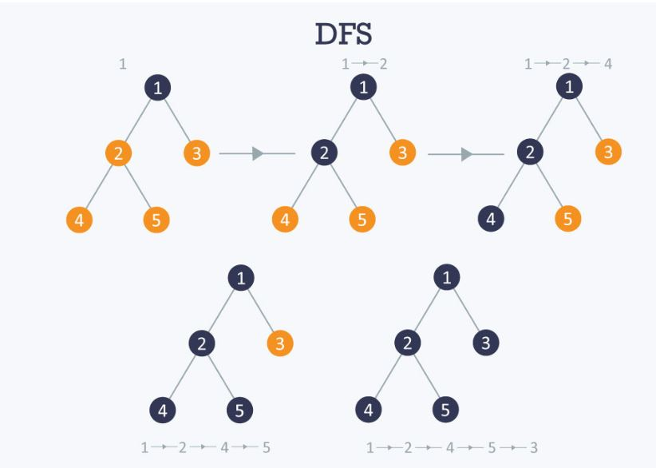

# 문제

- 학교 알고리즘 실습문제: 그래프 인접리스트 깊이 우선 탐색(Graph Adjacencylist DFS(Depth-First Search)) 문제

# 풀이

#### (생각하기)



> 출처: [hackerearth](https://www.hackerearth.com/practice/algorithms/graphs/depth-first-search/tutorial/)

- 깊이 우선 탐색(DFS): 트리나 그래프에서 한 루트로 탐색하다가 특정 상황에서 최대한 깊숙히 들어가서 확인한 뒤 다시 돌아가 다른 루트로 탐색하는 방식

- 역추적 개념을 사용하는 재귀적 알고리즘이며, 가능한 한 모든 노드를 백트랙(backtrack)으로 진행하여 완전히 검색하는 것

  - 백트랙(backtrack): 앞으로 나아가고 있고 현재 경로를 따라 더 이상 노드가 없을 때, 동일한 경로에서 역방향으로 이동하여 통과할 노드를 찾는 것

- 어떤 노드를 방문했는지 여부를 검사해야 함(같은 노드를 두 번 이상 방문하는 것을 막기 위함)
- DFS는 그래프(정점의 수: N, 간선의 수: E)의 모든 간선을 조회한다.
  - 인접 리스트로 표현된 그래프: O(N+E)
  - 인접 행렬로 표현된 그래프: O(N^2)

#### (구현하기)

- 구현 방법은 2가지가 있음

  - 재귀 호출
  - 스택(방문한 정점들을 스택에 저장했다가 다시 pop하여 작업)

- 그래프는 인접리스트 구조를 사용하여 표현
- DFS함수는 재귀 호출을 이용
  - ```C
      DFS(u){
      u 방문;
      for u의 인접 정점들 w에 대해서
          if (w를 아직 방문하지 않았으면)
              DFS(w); //재귀호출
      }
    ```

> 입력
>
> - 첫 줄에 정점의 개수 n , 간선의 개수 m, 순회 시작 정점 번호 s가 주어짐
> - 이후 m개의 줄에 한 줄에 하나씩 간선의 정보(간선의 양 끝 정점 번호)가 주어짐. (간선은 임의의 순서로 입력, 중복 입력되는 간선은 없음)
> - 무방향 간선
>
> 출력
>
> - 출발정점 s에서 출발하는 DFS의 방문 순서대로 정점 번호를 출력
>
> 

# 소스코드 (C언어)

```C
#include<stdio.h>
#include<stdlib.h>

enum VisitMode { Visited, NotVisited };

typedef int ElementType;

typedef struct tagVertex {
	ElementType data; //정점 데이터
	int visited; //방문여부

	struct tagVertex *next; //다음 정점
	struct tagEdge *adjacencyList; //인접 정점 리스트
}Vertex;

typedef struct tagEdge {
	struct tagEdge *next; //다음 간선
	Vertex *from; //정점 시작
	Vertex *target; //정점 끝
}Edge;

typedef struct tagGraph {
	Vertex *vertices; //정점 목록

}Graph;

Graph* CreateGraph();//그래프생성
void initVertex(Vertex *vertex, int vertexSize); //정점생성
Edge* CreateEdge(Vertex* from, Vertex* target); //간선생성
void AddEdge(Vertex* v, Edge* e); //간선 추가
void AddVertex(Graph* g, Vertex* v);//정점추가


Graph* CreateGraph() { //그래프 생성
	Graph* graph = (Graph*)malloc(sizeof(Graph));
	graph->vertices = NULL;

	return graph;
}


void initVertex(Vertex *vertex, int vertexSize) { //정점생성
	int i = 0;
	for (i = 1; i <= vertexSize; i++) {
		vertex[i].data = i;
		vertex[i].next = NULL;
		vertex[i].adjacencyList = NULL;
		vertex[i].visited = NotVisited;
	}

}


Edge* CreateEdge(Vertex* from, Vertex* target) { //간선생성
	Edge *edge = (Edge*)malloc(sizeof(Edge));
	edge->from = from;
	edge->target = target;
	edge->next = NULL;

	return edge;
}


void AddVertex(Graph* g, Vertex* v) {//정점추가
	Vertex* vertexList = g->vertices;

	if (vertexList == NULL) {
		g->vertices = v;
	}
	else {

		while (vertexList->next != NULL) {
			if (vertexList->data == v->data||vertexList->next->data==v->data) { //정점이 중복되면 return
				return;
			}
			vertexList = vertexList->next;
		}
		vertexList->next = v;
	}


}

void AddEdge(Vertex* vertex, Edge* edge) { //간선 추가


	if (vertex->adjacencyList == NULL) {
		vertex->adjacencyList = edge;
	}
	else
	{
		Edge *adjacencyList = vertex->adjacencyList;

		while (adjacencyList->next != NULL) {

			if (adjacencyList->target->data > edge->target->data) { //맨 앞에 노드 삽입,인접리스트 next 정점이 크면
				edge->next = adjacencyList;
				vertex->adjacencyList = edge;
				return;
			}
			else if (adjacencyList->next->target->data > edge->target->data) { //인접리스트 next 정점이 크면
				edge->next = adjacencyList->next;
				adjacencyList->next = edge;
				return;
			}
			adjacencyList = adjacencyList->next;
		}

		if (adjacencyList->target->data > edge->target->data) { //맨 앞에 노드 삽입,인접리스트 next 정점이 크면
			edge->next = adjacencyList;
			vertex->adjacencyList = edge;
			return;
		}

		adjacencyList->next = edge; //adjacencyList->next==NULL이면
	}
}


void DFS(Vertex *startVertex) {
	startVertex->visited = Visited; //방문

	Edge *edge = NULL;

	printf("%d\n", startVertex->data);

	edge = startVertex->adjacencyList;

	while (edge != NULL) {
		if (edge->target != NULL && edge->target->visited == NotVisited) {
			DFS(edge->target);
		}
		edge = edge->next;
	}
}


int main() {
	Graph *graph = CreateGraph();


	int num;
	char ch;
	int vertex1, vertex2;

	int i = 0;
	int vertexSize, edgeSize, startVertex;//정점개수,간선개수,순회 시작 정점번호
	Vertex *vertex;

	scanf("%d %d %d", &vertexSize, &edgeSize, &startVertex);
	vertex = (Vertex*)malloc(sizeof(Vertex)*(vertexSize+1));

	initVertex(vertex, vertexSize);

	for (i = 0; i < edgeSize; i++) { //두 정점 간선 잇기
		scanf("%d %d", &vertex1, &vertex2);

		AddVertex(graph, (vertex+vertex1)); //그래프에 정점 추가
		AddVertex(graph, (vertex+vertex2));

		AddEdge((vertex+vertex1), CreateEdge(vertex+vertex1, vertex+vertex2)); //간선 추가
		AddEdge((vertex+vertex2), CreateEdge(vertex+vertex2, vertex+vertex1));
	}


	DFS((vertex + startVertex));

	return 0;
}


```

# 느낀점

- 재귀호출의 유용함을 생각해볼 수 있는 알고리즘이다.
- BFS 알고리즘과 어떤 차이점이 있는지 생각해보자.

# 참고자료(Reference)

- 문제해결중심으로 알고리즘 (저자:국형준)
- [나무위키-DFS](https://namu.wiki/w/DFS)
- [hackerearth](https://www.hackerearth.com/practice/algorithms/graphs/depth-first-search/tutorial/)
