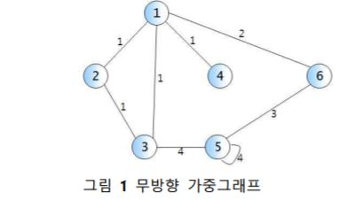
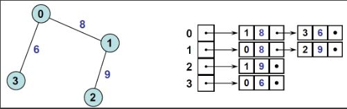

# 문제

- 학교 알고리즘 실습문제: 그래프 인접리스트(Graph Adjacencylist) 문제

# 풀이

#### (생각하기)

- 그래프란 일련의 노드(node, vertex) 집합 V와 간선(edge) 집합 E로 구성된 자료구조의 일종

- 인접리스트: 임의의 두 노드가 하나의 간선으로 연결되어 있을 경우, 이 노드들은 서로 인접(adjacent)해 있다고 한다. 인접해 있는 노드들을 리스트로 연결한 것

#### (구현하기)



> 그림1 무방향 그래프 구현



> 가중치가 있는 무방향 그래프를 위와 같이 인접리스트로 표현

- a `<node number>` : `<node number>`를 가지는 node와 인접한 node와 그
  노드까지의 간선 가중치를 모두 인쇄. 단, node number의
  **오름차순** 으로 인쇄하되, space 외의 구분자 없이 노드번호
  가중치 노드번호 가중치 ... 형식으로 인쇄한다. 그래프에 정점
  a가 존재하지 않으면 아무 것도 하지 않고 –1을 출력한다.

* m a b w : 간선 (a, b)의 가중치를 w로 변경한다. 그러한 간선이 존재하지 않을 때는
  가중치 w인 새로운 간선 (a, b)를 생성한다. w = 0이면 간선 (a, b)를
  삭제한다. 그래프에 정점 a 혹은 b가 존재하지 않으면 아무 것도 하지
  않고 –1을 출력한다.

* q : 프로그램 종료

입력예시 1
| 입력 | 출력 |
| ----- | ------------------- |
| a 2 | 1 1 3 1
| m 4 2 3 |
| a 2 | 1 1 3 1 4 3
| q | |

입력예시 2
| 입력 | 출력 |
| ----- | ------------------- |
| a 5 | 3 4 5 4 6 3
| m 3 5 0 |
| a 5 | 5 4 6 3
| a 7 | -1 |
| q | |

# 소스코드 (C언어)

```C
#include<stdio.h>
#include<stdlib.h>


typedef int ElementType;

typedef struct tagVertex {
	ElementType data; //정점 데이터
	struct tagVertex *next;
	struct tagEdge *adjacencyList; //인접 정점 리스트
}Vertex;

typedef struct tagEdge {
	int weight; //간선 가중치
	struct tagEdge *next; //다음 간선
	Vertex *from; //정점 시작
	Vertex *target; //정점 끝
}Edge;

typedef struct tagGraph {
	Vertex *vertices; //정점 목록
	int vertexCount; //정점 수
}Graph;

Graph* CreateGraph();//그래프생성
void DestroyGraph(Graph* g); //그래프 삭제
Vertex* CreateVertex(ElementType data); //정점생성
void DestroyEdgeOfVertex(Vertex* vertex, Edge* edge); //정점삭제
Edge* CreateEdge(Vertex* from, Vertex* target, int weight); //간선생성
void DestroyEdge(Edge* e);//간선삭제
void AddEdge(Vertex* v, Edge* e); //간선 추가
void AddVertex(Graph* g, Vertex* v);//정점추가
void PrintGraph(Graph* g); //출력
void modify(Graph *graph, int vertex1, int vertex2, int weight); //간선 변경사항 함수

Graph* CreateGraph() { //그래프 생성
	Graph* graph = (Graph*)malloc(sizeof(Graph));
	graph->vertices = NULL;
	graph->vertexCount = 0;
	return graph;
}


Vertex* CreateVertex(ElementType data) { //정점생성
	Vertex* v = (Vertex*)malloc(sizeof(Vertex));

	v->data = data;
	v->next = NULL;
	v->adjacencyList = NULL;
	v->visited = NotVisited;
	v->index = -1;

	return v;
}

void DestroyEdgeOfVertex(Vertex* vertex, Edge* edge) { //정점의 간선 삭제
	Edge* pEdge = vertex->adjacencyList->next;
	Edge* preEdge = vertex->adjacencyList;

	while (preEdge != NULL) {
		if (vertex->adjacencyList->target->data == edge->target->data) { //맨 앞에 노드 삭제일 때
			DestroyEdge(vertex->adjacencyList); //간선 삭제
			vertex->adjacencyList = pEdge;
			return;
		}
		else if (pEdge->target->data == edge->target->data) {
			preEdge->next = pEdge->next;
			DestroyEdge(pEdge);
			return;
		}
		preEdge = preEdge->next;
		pEdge = pEdge->next;
	}
}

Edge* CreateEdge(Vertex* from, Vertex* target, int weight) { //간선생성
	Edge *edge = (Edge*)malloc(sizeof(Edge));
	edge->from = from;
	edge->target = target;
	edge->next = NULL;
	edge->weight = weight;

	return edge;
}

void DestroyEdge(Edge* e) {//간선삭제
	free(e);
}

void AddVertex(Graph* g, Vertex* v) {//정점추가
	Vertex* vertexList = g->vertices;

	if (vertexList == NULL) {
		g->vertices = v;
	}
	else {
		while (vertexList->next != NULL) {
			vertexList = vertexList->next;
		}
		vertexList->next = v;
	}
	v->index = g->vertexCount++;

}

void AddEdge(Vertex* vertex, Edge* edge) { //간선 추가


	if (vertex->adjacencyList == NULL) {
		vertex->adjacencyList = edge;
	}
	else
	{
		Edge *adjacencyList = vertex->adjacencyList;

		while (adjacencyList->next != NULL) {

			if (adjacencyList->target->data > edge->target->data) { //맨 앞에 노드 삽입,인접리스트 next 정점이 크면
				edge->next = adjacencyList;
				vertex->adjacencyList = edge;
				return;
			}
			else if (adjacencyList->next->target->data > edge->target->data) { //인접리스트 next 정점이 크면
				edge->next = adjacencyList->next;
				adjacencyList->next = edge;
				return;
			}
			adjacencyList = adjacencyList->next;
		}

		if (adjacencyList->target->data > edge->target->data) { //맨 앞에 노드 삽입,인접리스트 next 정점이 크면
			edge->next = adjacencyList;
			vertex->adjacencyList = edge;
			return;
		}

		adjacencyList->next = edge; //adjacencyList->next==NULL이면
	}
}


void Print(Graph* g, int num) { //출력
	Vertex *vertex = g->vertices;
	Edge *edge = NULL;


	while (1) {

		if (vertex == NULL) {
			printf("-1\n");
			return;
		}

		edge = vertex->adjacencyList;

		/*if (edge == NULL)
			printf("-1\n");*/
		if (vertex->data == num) {
			//printf("%d :", vertex->data);
			while (edge != NULL) {
				printf(" %d %d", edge->target->data, edge->weight);
				edge = edge->next;
			}
			printf("\n");
			return;
		}

		vertex = vertex->next;
	}
	printf("\n");

}


void modify(Graph *graph, int vertexNum, int vertexNum2, int weight) { //간선 변경사항 함수

	Vertex *vertex = graph->vertices;
	Edge *edge = NULL;
	int cnt = 0;
	Vertex *vertex1, *vertex2;
	while (1) { //정점 유무 확인
		if (vertex == NULL) //정점이 둘 중에 하나 없거나, 둘 다 없으면 -1출력
		{
			printf("-1\n");
			return;
		}
		else if (vertex->data == vertexNum && vertex->data == vertexNum2) {
			vertex1 = vertex;
			vertex2 = vertex;
			break; //자기 자신을 가리키는 정점
		}
		else if (vertex->data == vertexNum) {
			vertex1 = vertex;
			cnt++;
		}
		else if (vertex->data == vertexNum2) {
			vertex2 = vertex;
			cnt++;
		}

		if (cnt == 2) //정점 두개 다 존재
			break;

		vertex = vertex->next;

	}
	cnt = 0;
	vertex = graph->vertices;
	while (1) {
		if (vertex->data == vertex1->data) {
			edge = vertex->adjacencyList;
			while (1) {
				if (edge == NULL) { //간선 존재x ->새로운 간선 생성
					if (weight == 0)
						return;

					if (vertex->data == vertex1->data && vertex->data == vertex2->data) {//자기자신을 가리킬 때
						AddEdge(vertex, CreateEdge(vertex, vertex1, weight));
						return;
					}
					else if (vertex->data == vertexNum) {
						//vertex2가 int형으로 매개변수 넘어가면 안됨
						AddEdge(vertex, CreateEdge(vertex, vertex2, weight));
						cnt++;
						break;
					}
					else if (vertex->data == vertexNum2) {
						AddEdge(vertex, CreateEdge(vertex, vertex1, weight));
						cnt++;
						break;
					}

				}
				else if (edge->target->data == vertex2->data && edge->target->data == vertex1->data) { //자기를 가르키는 간선이 존재하면
					if (weight == 0) { //간선 삭제
						DestroyEdgeOfVertex(vertex, edge);
						return;
					}
					edge->weight = weight; //weight 변경
					return;
				}
				else if (edge->target->data == vertex2->data) { //간선존재->가중치변경
					if (weight == 0) { //간선 삭제
						DestroyEdgeOfVertex(vertex, edge);
					}
					else {
						edge->weight = weight;
					}
					cnt++;
					break;
				}
				edge = edge->next;

			} //~while
			if (cnt == 2)
				return;
		} //~if
		else if (vertex->data == vertex2->data) {
			edge = vertex->adjacencyList;
			while (1) {
				if (edge == NULL) { //간선 존재x ->새로운 간선 생성
					if (weight == 0)
						return;

					if (vertex->data == vertex1->data && vertex->data == vertex2->data) {//자기자신을 가리킬 때
						AddEdge(vertex, CreateEdge(vertex, vertex1, weight));
						return;
					}
					else if (vertex->data == vertexNum) {
						//vertex2가 int형으로 매개변수 넘어가면 안됨
						AddEdge(vertex, CreateEdge(vertex, vertex2, weight));
						cnt++;
						break;
					}
					else if (vertex->data == vertexNum2) {
						AddEdge(vertex, CreateEdge(vertex, vertex1, weight));
						cnt++;
						break;
					}

				}
				else if (edge->target->data == vertex2->data && edge->target->data == vertex1->data) { //자기를 가르키는 간선이 존재하면
					if (weight == 0) { //간선 삭제
						DestroyEdgeOfVertex(vertex, edge);
						return;
					}
					edge->weight = weight; //weight 변경
					return;
				}
				else if (edge->target->data == vertex1->data) { //간선존재->가중치변경
					if (weight == 0) { //간선 삭제
						DestroyEdgeOfVertex(vertex, edge);
					}
					else {
						edge->weight = weight;
					}
					cnt++;
					break;
				}
				edge = edge->next;

			} //~while
			if (cnt == 2)
				return;
		}//~else if
		vertex = vertex->next;
	}//~while
}

int main() {
	Graph *graph = CreateGraph();

	//정점 생성
	Vertex* v1 = CreateVertex(1);
	Vertex* v2 = CreateVertex(2);
	Vertex* v3 = CreateVertex(3);
	Vertex* v4 = CreateVertex(4);
	Vertex* v5 = CreateVertex(5);
	Vertex* v6 = CreateVertex(6);

	//정점 그래프에 추가
	AddVertex(graph, v1);
	AddVertex(graph, v2);
	AddVertex(graph, v3);
	AddVertex(graph, v4);
	AddVertex(graph, v5);
	AddVertex(graph, v6);

	//간선 추가
	AddEdge(v1, CreateEdge(v1, v2, 1));
	AddEdge(v1, CreateEdge(v1, v3, 1));
	AddEdge(v1, CreateEdge(v1, v4, 1));
	AddEdge(v1, CreateEdge(v1, v6, 2));

	AddEdge(v2, CreateEdge(v2, v1, 1));
	AddEdge(v2, CreateEdge(v2, v3, 1));

	AddEdge(v3, CreateEdge(v3, v1, 1));
	AddEdge(v3, CreateEdge(v3, v2, 1));
	AddEdge(v3, CreateEdge(v3, v5, 4));

	AddEdge(v4, CreateEdge(v4, v1, 1));

	AddEdge(v5, CreateEdge(v5, v3, 4));
	AddEdge(v5, CreateEdge(v5, v5, 4));
	AddEdge(v5, CreateEdge(v5, v6, 3));

	AddEdge(v6, CreateEdge(v6, v1, 2));
	AddEdge(v6, CreateEdge(v6, v5, 3));


	int num;
	char ch;
	int vertex1, vertex2, weight;

	while (1) {
		scanf("%c", &ch);

		if (ch == 'a') { //노드번호 오름차순으로 (인접노드, 가중치) 순서대로 출력
			scanf("%d", &num);
			Print(graph, num);
		}
		else if (ch == 'm') {
			scanf("%d %d %d", &vertex1, &vertex2, &weight);
			modify(graph, vertex1, vertex2, weight);
		}
		else if (ch == 'q') {
			return 0;
		}
		getchar();
	}


	return 0;
}


```

# 느낀점

- 인접리스트를 오름차순으로 구현하는 것, 간선의 존재 유무에 따른 구현 등 다양한 조건을 생각해서 그래프를 구현하는 것에 많은 고민과 오랜 시간을 투자한만큼 유익했다.
- 자기자신을 가리키는 노드를 구현해야하는 것을 유의깊게 생각해서 조건문을 구현해야한다.

# 참고자료

- 문제해결중심으로 알고리즘 (저자:국형준)
