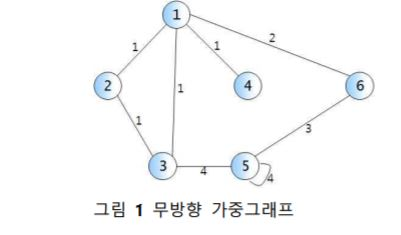

# 문제

- 학교 알고리즘 실습문제: 그래프 인접행렬(Graph AdjacencyMatrix) 문제

# 풀이

#### (생각하기)

- 그래프란 일련의 노드(node, vertex) 집합 V와 간선(edge) 집합 E로 구성된 자료구조의 일종

- 인접행렬: 임의의 두 노드가 하나의 간선으로 연결되어 있을 경우, 이 노드들은 서로 인접(adjacent)해 있다고 한다. 인접해 있는 노드들을 **2차원배열**로 구현한 것

#### (구현하기)



> 그림1 무방향 그래프 구현


> 가중치가 있는 무방향 그래프를 위와 같이 2차원배열을 활용하여 인접행렬로 표현([출처](https://www.thecrazyprogrammer.com/2014/03/representation-of-graphs-adjacency-matrix-and-adjacency-list.html))

- a `<node number>` : `<node number>`를 가지는 node와 인접한 node와 그
  노드까지의 간선 가중치를 모두 인쇄. 단, node number의
  **오름차순** 으로 인쇄하되, space 외의 구분자 없이 노드번호
  가중치 노드번호 가중치 ... 형식으로 인쇄한다. 그래프에 정점
  a가 존재하지 않으면 아무 것도 하지 않고 –1을 출력한다.

* m a b w : 간선 (a, b)의 가중치를 w로 변경한다. 그러한 간선이 존재하지 않을 때는
  가중치 w인 새로운 간선 (a, b)를 생성한다. w = 0이면 간선 (a, b)를
  삭제한다. 그래프에 정점 a 혹은 b가 존재하지 않으면 아무 것도 하지
  않고 –1을 출력한다.

* q : 프로그램 종료

입력예시 1
| 입력 | 출력 |
| ----- | ------------------- |
| a 2 | 1 1 3 1
| m 4 2 3 |
| a 2 | 1 1 3 1 4 3
| q | |

입력예시 2
| 입력 | 출력 |
| ----- | ------------------- |
| a 5 | 3 4 5 4 6 3
| m 3 5 0 |
| a 5 | 5 4 6 3
| a 7 | -1 |
| q | |

# 소스코드 (C언어)

```C
#include<stdio.h>
#include<stdlib.h>
#include<memory.h>

enum VisitMode { Visited, NotVisited };

typedef int ElementType;

typedef struct tagGraph {
	int **matrix; //그래프 인접행렬
	int vertexCount; //정점 개수
}Graph;

Graph* CreateGraph(int max_vertex);//그래프생성
void AddEdge(Graph *graph, int from, int target, int weight); //간선 생성
void deleteEdge(Graph *graph, int from, int target);//간선 삭제
int hasEdge(Graph *graph, int from, int target); //간선 존재 유무 확인
void modify(Graph *graph, int vertexNum, int vertexNum2, int weight); //간선 변경사항 함수
void Print(Graph *g, int num); // 인접노드, 가중치 출력

Graph* CreateGraph(int max_vertex) { //그래프 생성
	int i = 0;
	Graph* graph = (Graph*)malloc(sizeof(Graph));
	graph->vertexCount = max_vertex; //최대 정점 개수 설정
	graph->matrix = (int **)malloc(sizeof(int *)*(max_vertex+1));//인접행렬 메모리 할당

	for (i = 0; i <= max_vertex; i++) {
		graph->matrix[i] = (int *)malloc(sizeof(int)*(max_vertex+1));//i행 메모리 할당
		memset(graph->matrix[i], 0, sizeof(int)*(max_vertex+1)); //메모리 0으로 초기화
	}
	return graph;
}

void AddEdge(Graph *graph, int from, int target,int weight) { //간선 생성
	graph->matrix[from][target] = weight; //간선 weight 설정
	graph->matrix[target][from] = weight; //간선 weight 설정
}


void deleteEdge(Graph *graph, int from, int target) { //간선 삭제
	graph->matrix[from][target] = 0; //간선 0 설정
	graph->matrix[target][from] = 0; //간선 0 설정
}

int hasEdge(Graph *graph, int from,int target) {//간선 존재 유무 확인
	if (graph->matrix[from][target]) {//간선 존재
		return 1;
	}
	else { //간선 존재 x
		return 0;
	}
}
void modify(Graph *graph, int vertexNum, int vertexNum2, int weight) { //간선 변경사항 함수

	if (vertexNum > graph->vertexCount|| vertexNum2 > graph->vertexCount
		|| vertexNum<1||vertexNum2<1) { //정점이 존재하지 않을 때
		printf("-1\n");
		return;
	}


	if (weight == 0) { //간선 삭제
		deleteEdge(graph, vertexNum, vertexNum2);
	}
	else {
		if (hasEdge(graph,vertexNum,vertexNum2)) { //간선존재->가중치 변경
			graph->matrix[vertexNum][vertexNum2] = weight; //간선 weight 설정
			graph->matrix[vertexNum2][vertexNum] = weight; //간선 weight 설정
		}
		else {
			AddEdge(graph,vertexNum,vertexNum2,weight);
		}
	}


}

void Print(Graph *g,int num) //출력
{
	int i;

	if (g->vertexCount < num || num < 1) {
		printf("-1\n");
		return;
	}

	for (i = 1; i <= g->vertexCount; i++)

	{

		if (g->matrix[num][i])
		{
			printf(" %d %d", i, g->matrix[num][i]);
		}

	}
	printf("\n");
}

int main() {
	Graph *graph = CreateGraph(6);

	int num;
	char ch;
	int vertex1, vertex2, weight;

	//간선 추가
	AddEdge(graph, 1, 2, 1);
	AddEdge(graph, 1, 3, 1);
	AddEdge(graph, 1, 4, 1);
	AddEdge(graph, 1, 6, 2);

	AddEdge(graph, 2, 3, 1);

	AddEdge(graph, 3, 5, 4);

	AddEdge(graph, 5, 5, 4);

	AddEdge(graph, 5, 6, 3);

	while (1) {
		scanf("%c", &ch);

		if (ch == 'a') { //노드번호 오름차순으로 (인접노드, 가중치) 순서대로 출력
			scanf("%d", &num);
			Print(graph, num);
			//ViewNeighbors(graph);
		}
		else if (ch == 'm') {
			scanf("%d %d %d", &vertex1, &vertex2, &weight);
			modify(graph, vertex1, vertex2, weight);
		}
		else if (ch == 'q') {
			return 0;
		}
		getchar();
	}

	return 0;
}
```

# 느낀점

- 인접리스트를 구현해보고, 인접행렬을 구현해보니 간단하게 구현하는 느낌이었다.
- 특정 정점의 인접해 있는 정점들을 검색하려면 해당 정점의 배열 길이를 반복해서 순회해야하므로 비효율적인면이 있다.

# 참고자료

- 문제해결중심으로 알고리즘 (저자:국형준)
