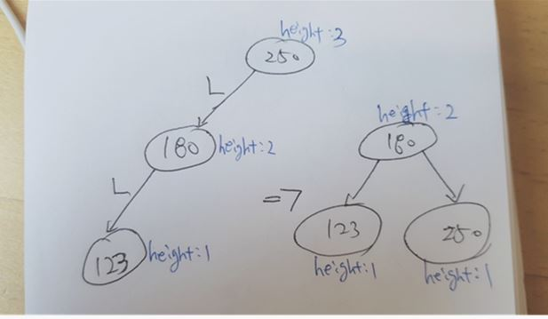
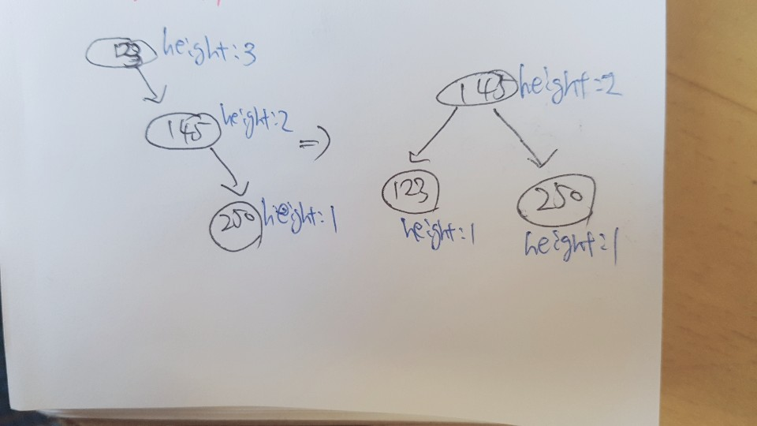
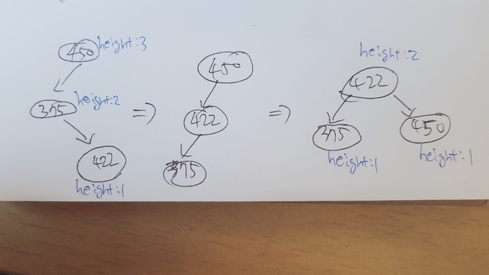
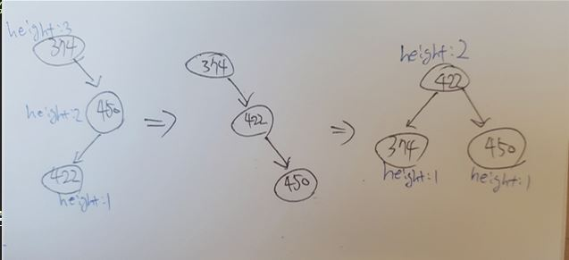

# 문제

- 학교 알고리즘 실습문제: AVL-tree(균형트리) 문제

# 풀이

#### (생각하기)

- AVL트리: 한쪽으로 치우쳐 노드가 증가하는 현상을 방지하여, 높이의 균형을 유지하는 이진탐색트리

- AVL트리 시간복잡도 : 검색,삽입,삭제 모두 O(log n)의 시간복잡도를 기대할 수 있다.

- 모든 노드의 왼쪽과 오른쪽 서브트리의 높이 차이가 1 이하여야 균형이 맞는 트리이다.

- < Single Rotation>

  (LL)

    

  > LL : 왼쪽은 height 차이가 2이고 오른쪽은 0이므로 왼쪽이 균형이 무너짐 -> 오른쪽으로 회전

  (RR)

    

  > RR : 왼쪽은 height 차이가 0이고 오른쪽은 2이므로 오른쪽이 균형이 무너짐 -> 왼쪽으로 회전


    < Double Rotation>

    (LR)

    

    > LR : 가장 마지막 노드인 422값을 부모노드와 자리를 바꾸면 single rotation 형태인 RR의 형태를 이루기 때문에 왼쪽으로 한번 더 회전시킴

    (RL)

    

    > RL : 가장 마지막 노드인 422값을 부모노드와 자리를 바꾸면 single rotation 형태인 LL의 형태를 이루기 때문에 오른쪽쪽으로 한번 더 회전시킴

#### (구현하기)

- 삽입(i,key) : key를 받아 노드생성 및 트리에 삽입

- 탐색(s,key) : key를 받아 트리에 존재하면 해당 키를 출력, 없다면 X를 출력

- 출력(p) : 현재 트리를 전위순회로 출력
- 삭제(d,key) : 입력받은 key를 트리에서 삭제하고, 반환값 출력
- 종료(q) : 프로그램 종료

| 입력 | 출력       |
| ---- | ---------- |
| i 38 |
| i 15 |
| i 64 |
| i 5  |
| i 34 |
| d 64 | 64         |
| p    | 15 5 38 34 |
| q    |

# 소스코드 (C언어)

```C
#include<stdio.h>
#include<stdlib.h>

typedef struct tree { //이진트리 구조체
	int key;
	int height;
	struct tree *lChild;
	struct tree *rChild;
	struct tree *parent;
}Tree;

Tree* getNode(int key); //노드생성
void insertItem(Tree **tree, int key); //노드 삽입
Tree* searchAndFixAfterInsertion(Tree *tree);//삽입후 AVL 트리 균형이 맞는지 검사하고 restructure함수 호출
Tree* restructure(Tree *x, Tree *y, Tree *z); //AVL트리 균형에 맞게 개조
int updateHeight(Tree *tree); //트리 높이 갱신
int isBalanced(Tree *tree); //AVL트리 균형검사
int maxFunc(int lHeight, int rHeight); //최대값 반환
Tree* treeSearch(Tree *tree, int key);//트리 탐색:현재 트리에서 키 k를 저장한 노드 반환
int isExternal(Tree *tree); //외부노드이면 1반환
int isInternal(Tree *tree); //내부노드이면 1반환
void expandExternal(Tree *tree); //외부노드 확장
void preorder(Tree *tree); //전위순회 출력
int removeElement(Tree **tree, int key); //삭제할 key 반환
Tree* reduceExternal(Tree *tree); //외부노드 삭제
Tree* sibling(Tree *tree); //형제노드 반환
Tree* inOrderSucc(Tree *tree); //중위순회계승자 반환
int findElement(Tree *tree, int key);//트리에 key있으면 반환
Tree* searchAndFixAfterRemoval(Tree *z); //삭제후 AVL 트리 균형검사

Tree* getNode(int key) { //새로운 노드생성
	Tree *tree;

	tree = (Tree *)malloc(sizeof(Tree));

	tree->key = key;
	tree->height = 0;
	tree->lChild = NULL;
	tree->rChild = NULL;
	tree->parent = NULL;

	return tree;
}

void insertItem(Tree **tree, int key) { //노드 삽입
	//Tree *new_node;
	Tree *temp;


	//new_node = getNode(key); //삽입할 노드 생성

	temp = treeSearch(*tree, key);

	if (isInternal(temp))
		return;
	else { //temp가 외부노드라면
		temp->key = key;
		expandExternal(temp);
		temp = searchAndFixAfterInsertion(temp);

		if (temp->parent == NULL) { //root의 parent가 NULL이면
			*tree = temp;
		}
		return;

	}

}

Tree* searchAndFixAfterInsertion(Tree *tree) { //매개변수:internal node
	Tree *treeParent;
	Tree *y, *x;

	//{Update heights and search for imbalance}
	tree->lChild->height = 0;
	tree->rChild->height = 0;
	tree->height = 1;

	if (tree->parent == NULL)
		return tree;

	treeParent = tree->parent;

	while (updateHeight(treeParent) && isBalanced(treeParent)) {
		if (treeParent->parent == NULL)
			return tree;
		treeParent = treeParent->parent;
	}

	if (isBalanced(treeParent))
		return tree;

	//{Fix imbalance}
	if (treeParent->lChild->height > treeParent->rChild->height)
		y = treeParent->lChild;
	else
		y = treeParent->rChild;

	if (y->lChild->height > y->rChild->height)
		x = y->lChild;
	else
		x = y->rChild;

	treeParent = restructure(x, y, treeParent);

	return treeParent; //root를 return

}

Tree* restructure(Tree *x, Tree *y, Tree *z) {
	//z is the parent of y
	//y is the parent of x
	Tree *a, *b, *c;
	Tree *T0, *T1, *T2, *T3;


	if (z->key < y->key && y->key < x->key) {
		a = z;
		b = y;
		c = x;

		T0 = a->lChild;
		T1 = b->lChild;
		T2 = c->lChild;
		T3 = c->rChild;
	}
	else if (x->key < y->key&&y->key < z->key) {
		a = x;
		b = y;
		c = z;

		T0 = a->lChild;
		T1 = a->rChild;
		T2 = b->rChild;
		T3 = c->rChild;
	}
	else if (z->key < x->key&&x->key < y->key) {
		a = z;
		b = x;
		c = y;

		T0 = a->lChild;
		T1 = b->lChild;
		T2 = b->rChild;
		T3 = c->rChild;
	}
	else { //y->key < x->key&&x->key < z->key
		a = y;
		b = x;
		c = z;

		T0 = a->lChild;
		T1 = b->lChild;
		T2 = b->rChild;
		T3 = c->rChild;
	}

	//{Replace the subtree rooted at z with a new subtree rooted at b}
	if (z->parent == NULL) //isRoot(z)
	{
		//root = b;
		z->parent = b;
		b->parent = NULL;
	}
	else if (z->parent->lChild == z) {
		z->parent->lChild = b;
		b->parent = z->parent;
	}
	else { //z->parent->rChild==z
		z->parent->rChild = b;
		b->parent = z->parent;
	}

	//{Let T0 and T1 be the left and the right subtree of a}
	a->lChild = T0;
	T0->parent = a;
	a->rChild = T1;
	T1->parent = a;
	updateHeight(a);

	//{Let T2,T3 be the left and the right subtree of c}
	c->lChild = T2;
	T2->parent = c;
	c->rChild = T3;
	T3->parent = c;
	updateHeight(c);

	//{Let a and c be the left and the right child of b}
	b->lChild = a;
	a->parent = b;
	b->rChild = c;
	c->parent = b;
	updateHeight(b);

	return b; //root를 return

}

int updateHeight(Tree *tree) { //매개변수:internal node
	int height;
	Tree *L;
	Tree *R;

	L = getNode(0);
	R = getNode(0);

	L = tree->lChild;
	R = tree->rChild;
	height = maxFunc(L->height, R->height) + 1;

	if (height != tree->height) {
		tree->height = height;
		return 1;
	}
	else
		return 0;
}

int isBalanced(Tree *tree) { //매개변수:internal node
	if (tree->lChild->height > tree->rChild->height)
		return ((tree->lChild->height) - (tree->rChild->height)) < 2;
	else
		return ((tree->rChild->height) - (tree->lChild->height)) < 2;
}

int maxFunc(int lHeight, int rHeight) { //큰 값 반환

	if (lHeight > rHeight)
		return lHeight;
	else
		return rHeight;
}

void expandExternal(Tree *tree) { //외부노드 확장
	Tree *L = getNode(0);
	Tree *R = getNode(0);

	L->parent = tree;
	R->parent = tree;

	tree->lChild = L;
	tree->rChild = R;
	return;

}

Tree* treeSearch(Tree *tree, int key) { //트리 탐색:현재 트리에서 키 k를 저장한 노드 반환
	if (isExternal(tree))
		return tree;
	if (key == tree->key) //key가 같으면
		return tree;
	else if (key < tree->key) {  //입력key가 트리key보다 작으면
		return treeSearch(tree->lChild, key);
	}
	else { //key>tree->key //입력key가 트리key보다 크면
		return treeSearch(tree->rChild, key);
	}
}

int isExternal(Tree *tree) { //외부노드이면 1반환
	if (tree->lChild == NULL && tree->rChild == NULL) {
		return 1; //참
	}
	else { //tree->lChild !=NULL || tree->rChild != NULL
		return 0; //거짓
	}
}

int isInternal(Tree *tree) { //내부노드이면 1반환
	if (tree->lChild != NULL || tree->rChild != NULL) {
		return 1; //참
	}
	else { //tree->lChild ==NULL && tree->rChild == NULL
		return 0; //거짓
	}
}

int removeElement(Tree **tree, int key) { //key 삭제
	Tree *temp;
	Tree *successor;//중위순회계승자(inorder successor)
	Tree *successor_child; //중위순회계승자의 자식
	Tree *root;
	int element; //삭제시 반환 할 원소

	temp = treeSearch(*tree, key);

	if (isExternal(temp)) //외부노드이면
	{
		return 0;
	}


	element = temp->key; //삭제 할 원소 임시저장
	successor_child = temp->lChild; //중위순회계승자의 자식<-삭제노드의 왼쪽자식

	if (!isExternal(successor_child))
		successor_child = temp->rChild;
	if (isExternal(successor_child)){
		successor = reduceExternal(successor_child); //successor 로 받는게 맞는지 확인할 것
		if (successor->parent == NULL) { //노드가 1개남았을 때
			(*tree) = successor;
			return element;
		}
	}
	else {
		successor = inOrderSucc(temp); //중위계승자 찾기
		successor_child = successor->lChild;
		temp->key = successor->key;

		successor = reduceExternal(successor_child);
	}

	root=searchAndFixAfterRemoval(successor->parent);
	if (root->parent == NULL) { //반환값이 root노드라면
		(*tree) = root; // root노드를 가리킨다.
	}
	return element;
}

Tree* searchAndFixAfterRemoval(Tree *z) { //삭제 후 트리 균형검사
	Tree *y, *x;
	Tree *treeParent;

	//{Update heights and search for imbalance}
	while (updateHeight(z) && isBalanced(z)){
		if (z->parent == NULL)
			return z;
		z = z->parent;
	}
	if (isBalanced(z))
		return z;

	//{Fix imbalance}
	if (z->lChild->height > z->rChild->height) //왼쪽자식 높이가 오른쪽 자식 높이보다 더 크다면
		y = z->lChild;
	else //오른쪽 자식 높이가 더 크다면
		y = z->rChild;

	if (y->lChild->height > y->rChild->height)
		x = y->lChild;
	else if (y->lChild->height < y->rChild->height)
		x = y->rChild;
	else // y->lChild->height == y->rChild->height
	{
		if (z->lChild == y)
			x = y->lChild;
		else //z->right ==y
			x = y->rChild;
	}

	 treeParent= restructure(x, y, z);
	 if (treeParent->parent == NULL) //개조한 반환값이 root노드라면
		 return treeParent;

	 searchAndFixAfterRemoval(treeParent->parent);

}

Tree* reduceExternal(Tree *tree) { //tree : 외부노드가 매개변수
	Tree *temp; //삭제할 노드
	Tree *brother; //외부노드의 형제노드
	Tree *gParent; //삭제할 노드의 부모노드
	Tree *root;

	temp = tree->parent; //외부노드의 부모는 삭제할 노드
	brother = sibling(tree); //형제노드 찾기
	root = temp;
	if (temp->parent == NULL) { //삭제할 노드의 부모가 NULL 이면(즉, 삭제할 노드가 root노드라면)
		root = brother; // 형제노드가 root노드가 된다.
		brother->parent = NULL;
	}
	else {
		gParent = temp->parent;
		brother->parent = gParent;
		if (temp == gParent->lChild) //삭제할노드가 삭제노드의 부모노드의 왼쪽자식이라면
			gParent->lChild = brother;  //삭제할 노드의 부모노드의 왼쪽자식에 형제노드 배치
		else
			gParent->rChild = brother; //삭제할 노드의 부모노드의 오른쪽자식에 형제노드 배치
	}

	free(tree);
	free(temp);
	return brother;
}

Tree* sibling(Tree *tree) { //형제노드 반환
	if (tree->parent == NULL) {
		return; //형제노드가 없음
	}
	if (tree->parent->lChild == tree) { //매개변수 노드가 왼쪽자식이라면
		return tree->parent->rChild;
	}
	else {//매개변수 노드가 오른쪽자식이라면
		return tree->parent->lChild;
	}
}

Tree* inOrderSucc(Tree *tree) { //중위순회 계승자 반환
	tree = tree->rChild;//오른쪽 자식으로 이동
	if (isExternal(tree))
		return;
	while (isInternal(tree->lChild))
		tree = tree->lChild;
	return tree;
}

int findElement(Tree *tree, int key) { //트리에 key있으면 반환
	tree = treeSearch(tree, key);
	if (isExternal(tree)) {
		return 0;
	}
	else
		return key;
}

void preorder(Tree *tree) { //전위순회 출력
	if (tree->key != 0) {
		printf(" %d", tree->key);
		preorder(tree->lChild);
		preorder(tree->rChild);
	}

}


int main() {
	char ch;
	int key;
	Tree *tree = getNode(0);

	while (1) {
		scanf("%c", &ch);

		if (ch == 'i') { //i <키> : 입력 <키>에 대한 노드 생성 및 트리에 삽입
			scanf("%d", &key);
			insertItem(&tree, key);
		}
		else if (ch == 'd') {//d <키> :입력 <키>가 트리에 존재하면 해당 노드 삭제 후 삭제된 키를 출력, 없으면 ‘X’를 출력
			scanf("%d", &key);
			key = removeElement(&tree, key);
			if (key) {
				printf("%d\n", key);
			}
			else {
				printf("X\n");
			}

		}
		else if (ch == 's') {//s <키>: 입력 <키>가 트리에 존재하면 해당 키를 출력, 없으면 ‘X’를 출력
			scanf("%d", &key);
			key = findElement(tree, key);
			if (key) {
				printf("%d\n", key);
			}
			else {
				printf("X\n");
			}
		}
		else if (ch == 'p') { //전위순회로 출력
			preorder(tree);
			printf("\n");
		}
		else if (ch == 'q') { //종료
			return;
		}
		getchar();
	}

	free(tree);
	return 0;
}
```

# 코드리뷰

# 느낀점

- 이전에 single rotation, double rotation에 대한 이해가 부족했는데, 직접 손으로 그려보니 이해가 되었음

# 참고자료

- 문제해결중심으로 알고리즘 (저자:국형준)
